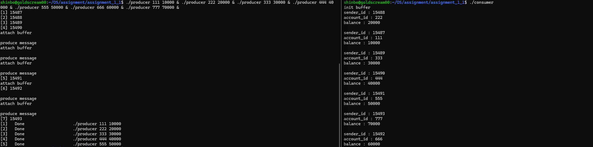
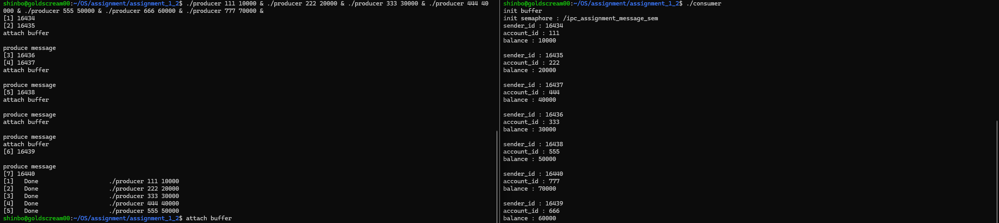
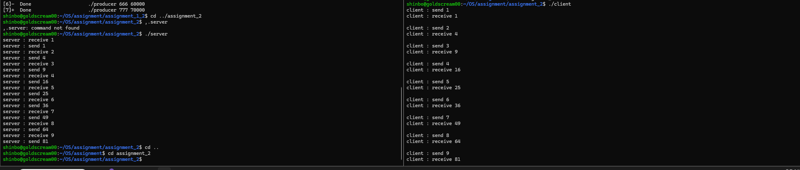

## 운영체제 실습 5
#### 2021171219 김재헌

### Assignment 1-1 & 1-2 : Shared Memory Buffer & Semaphore

#### Assignment 1-1 코드 수정

1) `init_buffer` (TODO 1):
- **수정 내용**: `shm_open`에 `O_CREAT | O_RDWR` 플래그를 주고, `ftruncate`로 사이즈를 맞춘 뒤 `mmap`을 호출한다. 그리고 `is_empty = 1`로 초기화한다.
- **이유**: 버퍼를 최초로 생성하는 역할이기에 `O_CREAT`를 통해 메모리 객체를 새로 만들고, 텅 빈 공간에 `MessageBuffer` 구조체 크기만큼의 공간을 할당(`ftruncate`)해야 데이터를 담을 수 있다.  

2) `attach_buffer` (TODO 2):
- **수정 내용**: `shm_open`에 `O_CREAT` 없이 `O_RDWR` 플래그만 주고 `mmap`을 호출한다.
- **이유**: 이 함수는 주로 Producer가 사용하고, 메모리 생성이 아니라 생성된 메모리에 접근(Attach)만 하기 때문이다.

3) `produce` (TODO 3):
- **수정 내용**: `while ((*buffer)->is_empty == 0) {}` 무한 루프(Busy waiting)를 추가한다.
- **이유**: 세마포어(알람)가 없기 때문에, Consumer가 데이터를 아직 안 읽어갔는데(`is_empty == 0`) Producer가 데이터를 또 쓰면 기존 데이터가 날아간다. 따라서 버퍼가 비워질 때까지 스스로 계속 확인하며 대기하도록 만들었다.

4) `consume` (TODO 4):
- **수정 내용**: `if ((*buffer)->is_empty == 1) return -1;` 코드를 상단에 추가한다.
- **이유**: 버퍼가 비어있는데 읽기를 시도하면 이상한 값을 읽게 된다. 따라서 비어있으면 즉시 -1을 반환하여, `consumer.c`의 `while(1)` 루프가 계속 재시도하도록 유도한다.

#### Assignment 1-2 코드 수정

1) `init_sem` (TODO 1):
- **수정 내용**: `sem_open`을 호출할 때 초기값을 1로 설정한다.
- **이유**: 세마포어의 값이 1이면 한 번에 오직 하나의 프로세스만 자물쇠를 풀 수 있다는 뜻이다. 이를 뮤텍스(Mutex)처럼 활용하여 완벽한 상호 배제(Mutual Exclusion)를 달성한다.

2) `destroy_sem` (TODO 2):
- **수정 내용**: `sem_close`와 `sem_unlink`를 호출한다.
- **이유**: 프로그램이 끝난 후 OS에 세마포어 자원을 반환하지 않으면 메모리 유출이 발생하거나 오류가 날 수 있으므로 깔끔하게 정리한다.

3) `produce` & `consume` (TODO 3-3, 3-4):
- **수정 내용**: 버퍼의 `is_empty` 상태를 확인하고, 데이터를 복사하고, 다시 `is_empty`를 업데이트하는 과정을 `s_wait()(Lock)`와 `s_quit()(Unlock)`로 묶는다.
- **이유**: 상태를 확인하고 데이터를 쓰는 짧은 순간이 임계 영역(Critical Section)이다. 따라서 이 과정을 자물쇠로 묶어두지 않으면 1-1처럼 상태를 확인하고 데이터를 쓰려는 순간에 다른 프로세스가 끼어들어 데이터를 덮어쓰는 경쟁 상태(Race Condition)가 발생하기 때문이다.

#### 1-1 코드 실행 결과

동기화가 없는 상태에서 7개의 producer를 동시에 실행했다. 위 실행결과에서 OS의 스케줄링 타이밍이 우연히도 맞아떨어져 데이터 유실이 발생하지 않았다. 하지만 이는 결정론적일 뿐 안전한 것이 아니며 만약 `is_empty`를 평가하는 시점과 데이터를 메모리에 쓴느 시점 사이에 context switch가 발생한다면 race condition이 발생할 수 있는 불안정한 상태이다. 

### 1-2 코드 실행 결과

1-1과 동일하게 터미널에서 7개의 producer 프로세스를 동시에 실행시킨다. comsumer 측의 출력 결과를 보면 111부터 777까지 총 7쌍의 데이터가 단 하나의 유실이나 오염 없이 완벽하게 수신되었다. 이를 통해 `s_wait()`과 `s_quit()`을 활용한 세마포어가 상호베제를 성공적으로 보장했음을 증명할 수 있다. 한 번에 하나의 프로세스만 공유 버퍼의 상태를 확인하고 데이터를 읽을 수 있기에 데이터의 무결성이 보존된다. 

### Assignment 2 : Named Pipe Client/Server

#### Client 측 구현

1) 교차된 `open()` 권한 (TODO 1): 
- **수정 내용**: 서버와 반대로 `send_fd`는 `O_WRONLY`로, `receive_fd`는 `O_RDONLY`로 연다.
- **이유**: 서버가 열어둔 파이프의 반대쪽 끝에 연결하기 위함이다. 서버가 읽는 파이프(`NP_RECEIVE`)에 클라이언트는 쓰기 권한(`O_WRONLY`)으로 연결하고, 서버가 쓰는 파이프(`NP_SEND`)에 클라이언트는 읽기 권한(`O_RDONLY`)으로 연결하여 완전한 양방향 통신의 파이프라인을 구축했다.

2) `write()` 후 `read()` (TODO 2): 

- **수정 내용**: `write()`로 데이터를 보낸 직후, 다음 줄에서 바로 `read()`를 호출한다.
- **이유**: 데이터를 보낸 후 `read()`를 호출하면, 서버가 계산을 마치고 파이프에 결과값을 넣어줄 때까지 클라이언트 프로세스는 대기 상태에 들어간다. 별도의 `sleep`이나 복잡한 동기화 코드 없이 파이프의 입출력 블로킹 특성을 통해 요청-응답 사이클을 안정적으로 구현한다.

#### Server 측 구현

1) `unlink()`와 `mkfifo()` (TODO 3): 

- **수정 내용**: `unlink()`로 기존 파이프 삭제 후, `mkfifo()`로 두 개의 파이프(`NP_RECEIVE`, `NP_SEND`)를 생성한다.
- **이유**: Named Pipe(FIFO)는 파일 시스템에 물리적인 특수 파일 형태로 존재한다. 만약 이전 실행에서 파이프 파일이 남아있다면, 다시 `mkfifo`를 호출할 때 에러가 발생할 수 있다. 따라서 안전한 실행을 위해 시작 전과 종료 후에 `unlink()`로 잔여 파이프를 제거한다.

2) `open()`의 블로킹 특성 활용 (TODO 3): 
- **수정 내용**: `receive_fd`는 `O_RDONLY`로, `send_fd`는 `O_WRONLY`로 연다.
- **이유**: 파이프는 단방향 통신이므로 역할에 맞는 권한을 부여해야 한다. 또한, Named Pipe에서 `open()` 함수는 반대편 파이프가 열릴 때까지 대기한다. 이를 통해 서버가 먼저 실행되더라도 클라이언트가 접속할 때까지 안전하게 대기하는 동기화를 달성할 수 있다.

3) `read()` (TODO 4): 

- **수정 내용**: `read()` 함수의 반환값이 0 이하일 경우 `break`한다.
- **이유**: 클라이언트가 송신을 모두 마치고 종료되면, 서버의 `read()` 함수는 `0`(EOF)을 반환한다. 무한 루프를 돌며 대기하는 서버가 이 상황을 감지하고 정상적으로 자원을 정리하며 종료할 수 있도록 예외 처리 조건을 명시했다.

4) `write()` (TODO 5): 
- **수정 내용 및 이유**: 연산이 완료된 결과값(문자열)을 `server_to_client` 파이프에 넣어 클라이언트에게 응답을 보낸다.

### 2 코드 실행 결과

위 스크린샷은 두 개의 Named Pipe(`client_to_server`, `server_to_client`)를 이용해 양방향 통신을 구현한 결과이다. Client가 보낸 정수 데이터가 파이프를 타고 Server로 전달되면, Server가 이를 제곱하여 다시 다른 파이프를 통해 Client에게 반환하는 일련의 과정이 성공적으로 동작함을 확인할 수 있다."