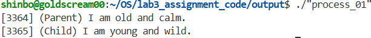
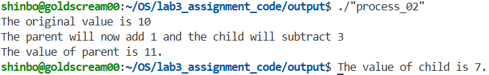
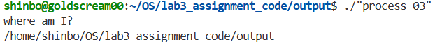
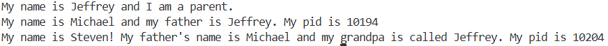
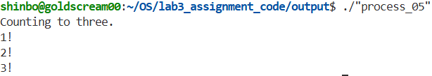
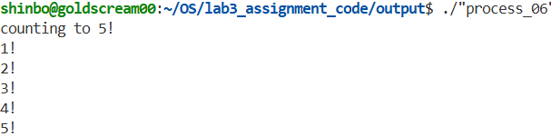
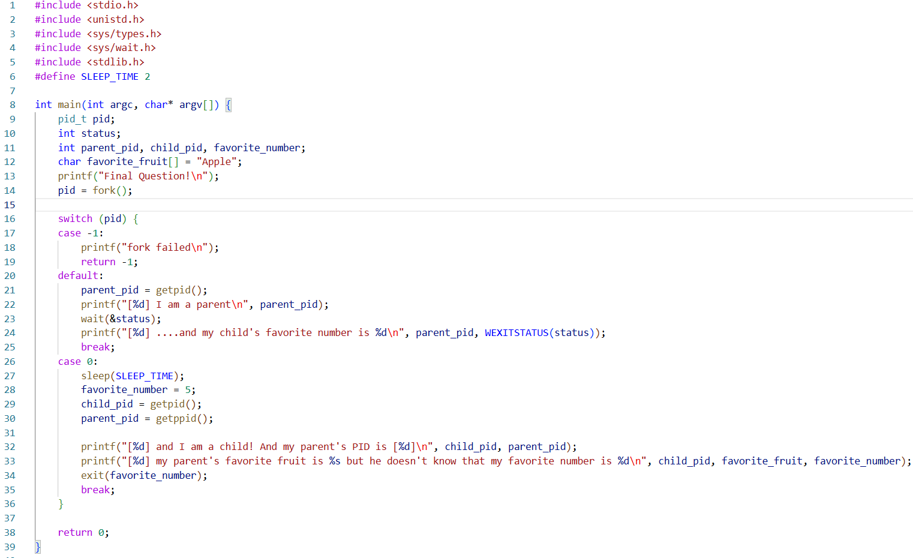
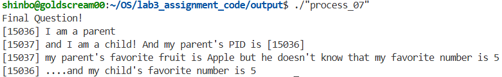

# 실습3 보고서
### 2021171219 김재헌

## ```process_01.c```

|빈칸|정답|
|---|---|
|</1>|```default```|
|</2>|```case 0```|
|</3>|```getpid()```|
|</4>|```0```|





## ```process_02.c```

|빈칸|정답|
|---|---|
|</1>|```pid > 0```|
|</2>|```pid == 0```|
|</3>|```0```|
|</4>|```val```|



## ```process_03.c```

|빈칸|정답|
|---|---|
|</1>|```"/bin/pwd", "pwd", NULL```|



## ```process_04.c```

|빈칸|정답|
|---|---|
|</1>|```default```|
|</2>|```case 0```|
|</3>|```pid2```|
|</4>|```child_name, name, getpid()```|
|</5>|```case 0```|
|</6>|```grandchild_name, child_name, name, getpid()```|




## ```process_05.c```

|빈칸|정답|
|---|---|
|</1>|```pid > 0```|
|</2>|```&status```|
|</3>|```WEXITSTATUS(status)```, ```3```|
|</4>|```pid == 0```|
|</5>|```3```, ```0```|



## ```process_06.c```

|빈칸|정답|
|---|---|
|</1>|```pid > 0```|
|</2>|```pid2 > 0```|
|</3>|```pid, &status, 0```|
|</4>|```pid2, &status, 0```|
|</5>|```pid2 == 0```|
|</6>|```pid == 0```|



## ```process_07.c```

#### 코드 스크린샷


#### 코드 설명

* `default:` 및 `parent_pid = getpid();`
    `fork()` 반환값이 양수인 영역으로 부모 프로세스가 실행된다. `getpid()` 함수를 호출하여 부모 프로세스의 고유 PID를 가져온다.


* `wait(&status);` 및 `WEXITSTATUS(status)`
    부모 프로세스는 자식이 끝날 때까지 기다려야 하므로 `wait()` 함수를 사용하여 자신의 실행을 블로킹(차단)한다. 이후 자식이 종료되면, `WEXITSTATUS(status)` 매크로를 통해 자식이 `exit()`로 넘겨준 5를 추출하여 출력한다.


* `case 0:` 및 `sleep(SLEEP_TIME);`
    반환값이 0이므로 자식 프로세스가 실행되는 영역입니다. 부모의 첫 번째 `printf`가 무조건 먼저 출력되도록 보장하기 위해, 문제 상단에 정의된 매크로 상수(`SLEEP_TIME 2`)를 활용하여 `sleep()` 함수로 2초간 대기합니다.


* `child_pid = getpid();` 및 `parent_pid = getppid();`
    자식 프로세스는 `getpid()`를 통해 자신의 PID를 확인하고, 추가적으로 `getppid()` 함수를 호출하여 자신의 부모 프로세스의 PID를 찾아낸다.


* `exit(favorite_number);`
    모든 작업을 마친 자식 프로세스는 메모리에서 종료됨과 동시에, 부모에게 자신의 숫자(5)를 전달하기 위해 `exit()` 함수의 인자로 해당 변수를 넣고 종료한다.

#### 실행결과
