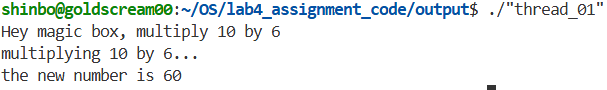
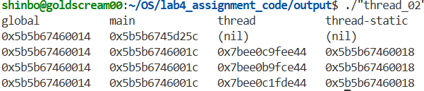
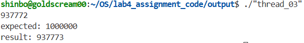
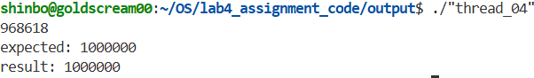
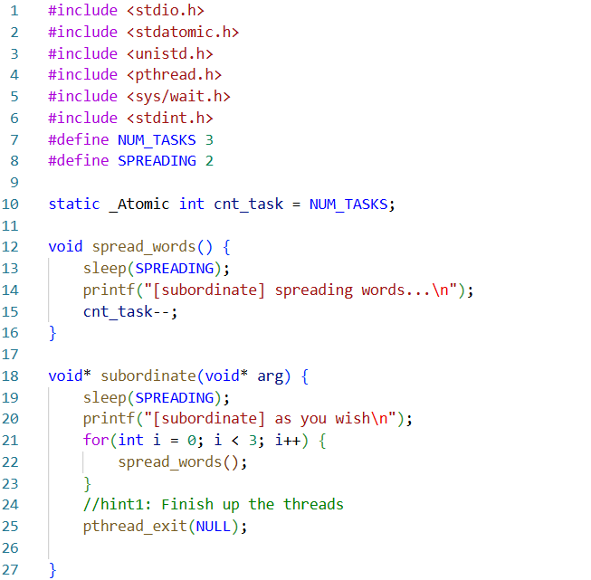
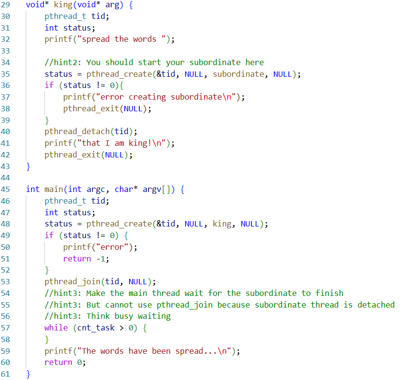
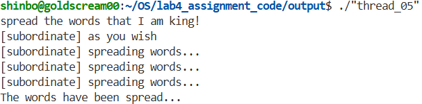
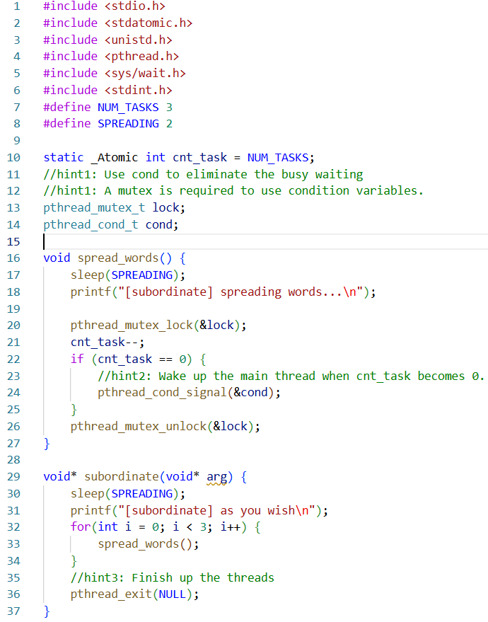
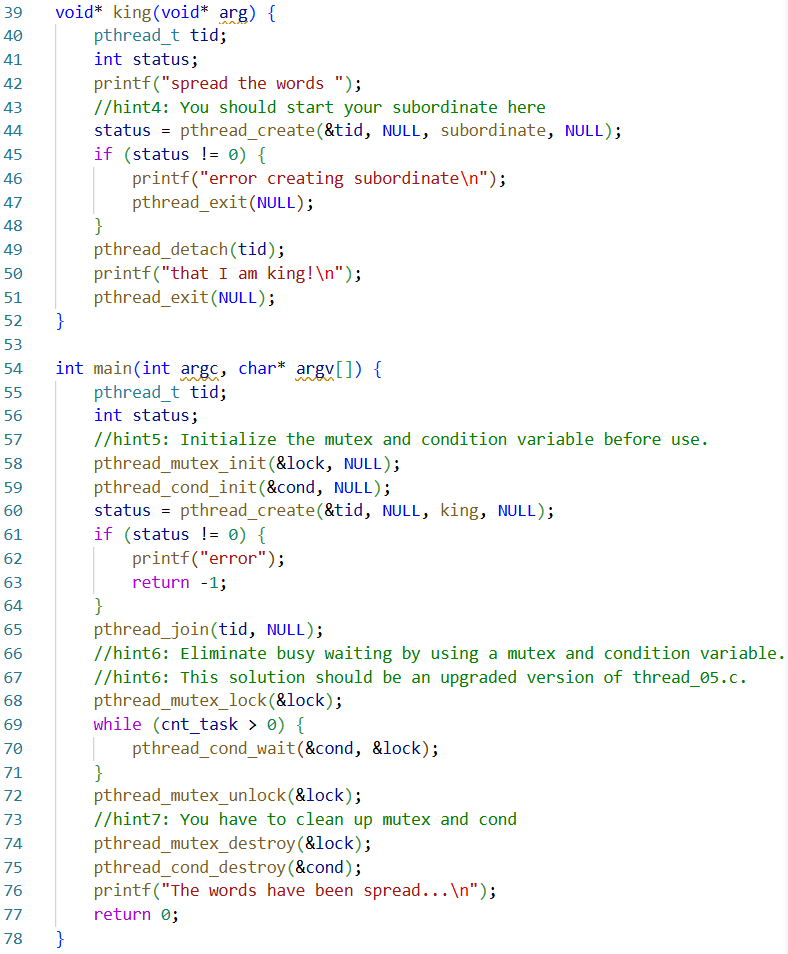
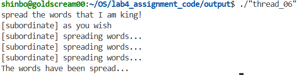

# 실습4 보고서
### 2021171219 김재헌

## ```thread_01.c```

|빈칸|정답|
|---|---|
|</1>|```create```|
|</2>|```&tid, NULL, magic_box, (void*)(intptr_t)10```|
|</3>|```join```|
|</4>|```tid, &new_number```|




## ```thread_02.c```

|빈칸|정답|
|---|---|
|</1>|```exit```|
|</2>|```create```|
|</3>|```&tids[i], NULL, worker, &main_static```|
|</4>|```join```|
|</5>|```tids[i]```|



## ```thread_03.c```

|빈칸|정답|
|---|---|
|</1>|```exit```|
|</2>|```void*```|
|</3>|```create```|
|</4>|```&tids[i], NULL, worker, NULL```|
|</5>|```join```|
|</6>|```tids[i], &progress```|



## ```thread_04.c```

|빈칸|정답|
|---|---|
|</1>|```mutex_lock```|
|</2>|```&lock```|
|</3>|```mutex_unlock```|
|</4>|```&lock```|
|</5>|```create```|
|</6>|```&tids[i], NULL, worker, NULL```|
|</7>|```join```|
|</8>|```tids[i], &progress```|




## ```thread_05.c```






#### 코드 설명

Hint 1 `pthread_exit`:
subordinate 스레드가 3번의 spread_words() 호출을 무사히 마치면, 메모리에서 안전하게 종료시키기 위해 pthread_exit(NULL);을 호출한다.

Hint 2 `pthread_create`:
king 스레드 안에서 새로운 subordinate(부하) 스레드를 생성해야 한다. 메인 함수에서 하던 것과 동일하게 pthread_create를 사용하여 스레드를 생성하는데 생성 직후 pthread_detach(tid);가 실행되므로, 이 스레드는 메인 프로세스와 분리되어 독자적으로 실행 후 자동 정리되는 상태가 된다.

Hint 3 `while` 문을 이용한 Busy waiting:
한 번 Detach된 스레드는 다시 pthread_join()을 사용하여 끝날 때까지 기다릴 수 없다. 따라서 메인 스레드가 먼저 종료되어 프로그램이 꺼지는 것을 막으려면 강제로 기다리게 만들어야 한다.
전역 변수로 선언된 cnt_task(NUM_TASKS인 3으로 초기화됨)가 subordinate 내부에서 0이 될 때까지 계속해서 while (cnt_task > 0) 루프를 맴돌게 한다. 이렇게 의미 없는 루프를 돌며 상태 변화를 지속적으로 확인하는 동기화 방식(Busy waiting)을 재현한다.

## ```thread_06.c```








#### 코드 설명

Hint 1 전역 뮤텍스와 조건 변수 선언:
조건 변수(cond)는 항상 뮤텍스(lock)와 짝을 이루어 사용해야한다. 여러 스레드에서 접근할 수 있도록 전역 변수로 선언한다.

Hint 2 메인 스레드 깨우기 (`spread_words` 내부):
subordinate 스레드가 남은 작업(cnt_task)을 0으로 만들면, 조건 변수에서 잠들어 있는 메인 스레드에게 작업 종료 신호(pthread_cond_signal)를 보낸다. 

Hint 3 스레드 종료 (`subordinate` 내부):
부하 스레드가 자신의 작업을 모두 마쳤으므로 메모리에서 안전하게 종료시킨다.

Hint 4 부하 스레드 생성 (`king` 내부):
king 스레드가 subordinate 스레드를 생성한다.

Hint 5 뮤텍스와 조건 변수 초기화 (`main` 내부):
스레드를 생성하기 전에 뮤텍스와 조건 변수를 사용할 수 있도록 초기화(init)해야 한다.

Hint 6 Busy waiting 제거 (`main` 내부):
pthread_cond_wait 함수를 사용하여 cnt_task가 0보다 큰 동안에는 CPU 점유를 포기하고 대기하게 한다. subordinate 스레드가 signal을 보내면 다시 깨어나서 조건문을 확인한 뒤 다음 코드로 진행한다. 

Hint 7 `main` 내부 정리:
프로그램이 종료되기 전, 사용이 끝난 뮤텍스와 조건 변수 객체를 destroy하여 시스템 자원을 반환한다.
