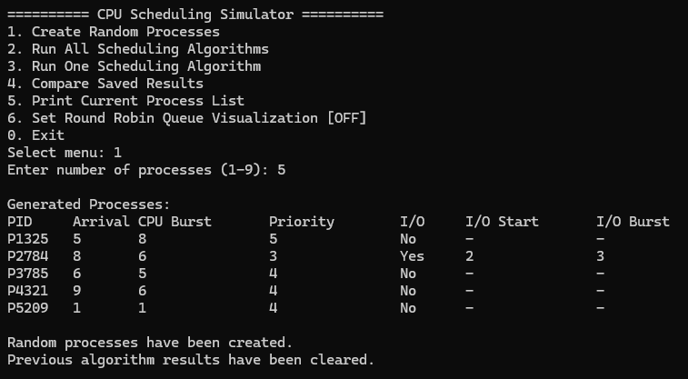
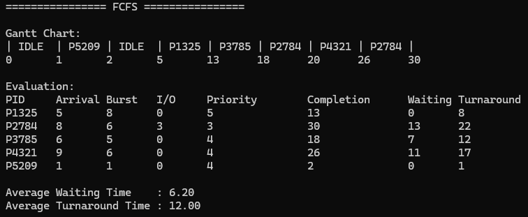
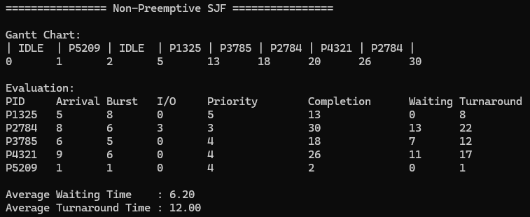
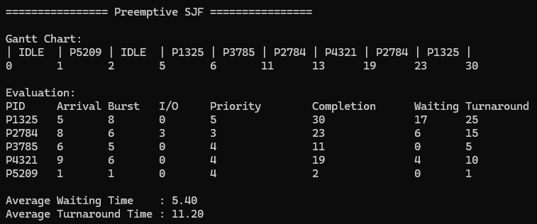
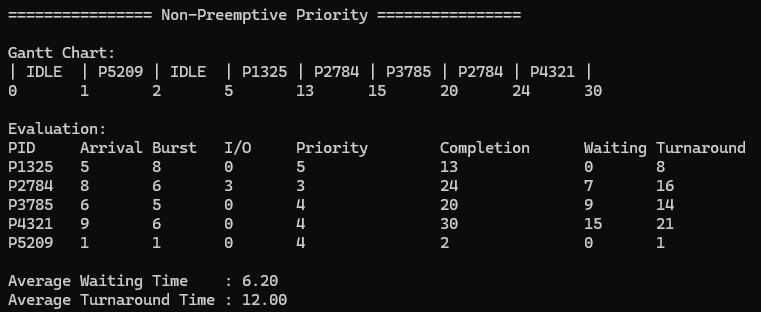
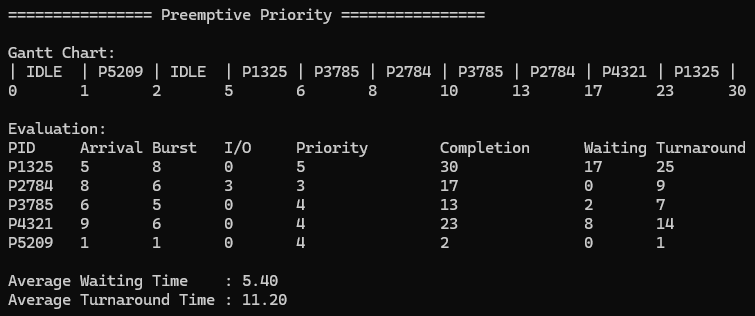
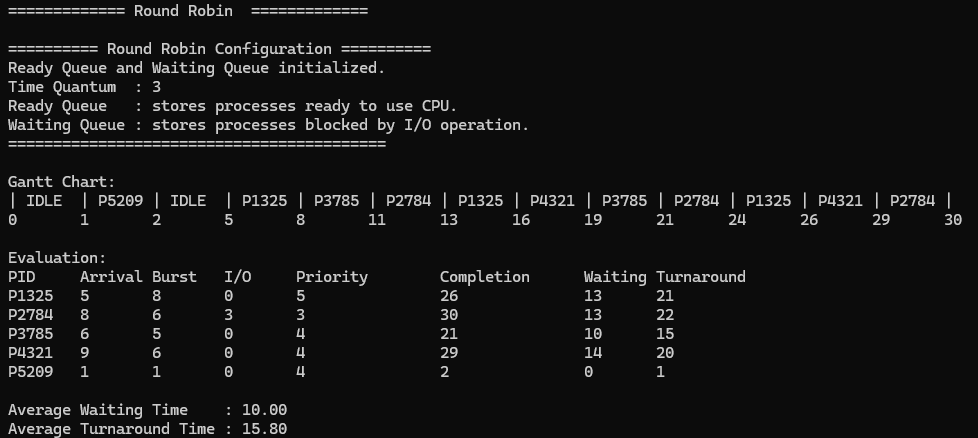
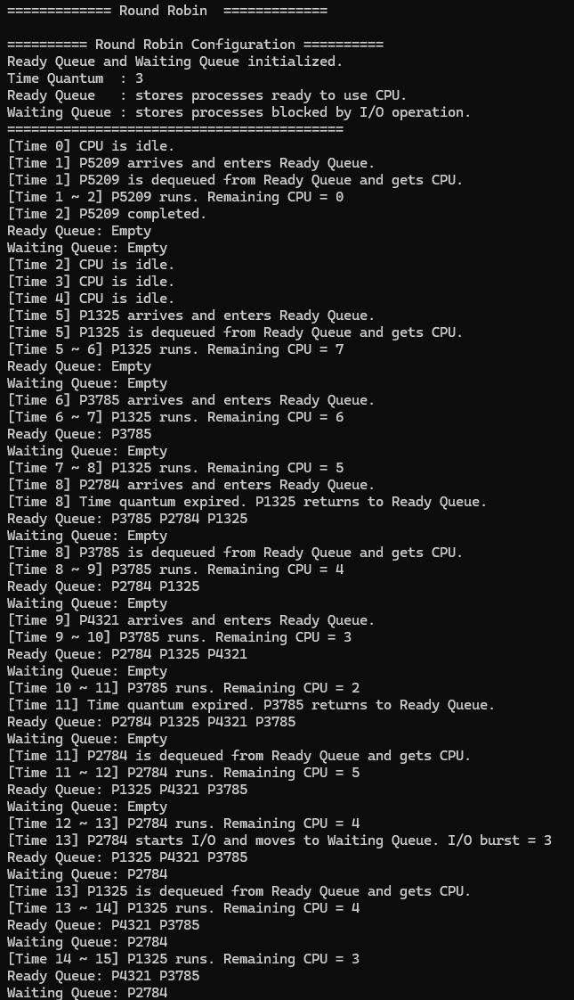
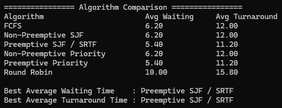

# CPU Scheduling Simulator 보고서

### 2021171219 김재헌
### 운영체제 26-1

## 1. 서론

운영체제는 여러 프로세스가 제한된 CPU 자원을 효율적으로 사용할 수 있도록 프로세스의 실행 순서를 결정해야 한다. CPU 스케줄링은 준비 상태에 있는 프로세스 중 다음에 CPU를 할당받을 프로세스를 선택하는 과정으로, 시스템의 처리량, 응답성 및 자원 활용률에 직접적인 영향을 미친다.

CPU 스케줄링 알고리즘은 프로세스의 도착시간, 실행시간, 우선순위 및 시간 할당량 등의 정보를 기준으로 실행 순서를 결정한다. 대표적인 알고리즘으로는 First-Come, First-Served/ Shortest Job First/ Priority Scheduling 및 Round Robin이 있다. 각 알고리즘은 서로 다른 선택 기준과 선점 여부를 사용하므로, 동일한 프로세스 집합을 적용하더라도 대기시간과 반환시간이 다르게 나타날 수 있다.

CPU 스케줄링 알고리즘의 성능을 평가하기 위해서는 평균 대기시간, 평균 반환시간, 응답시간, 처리량 및 CPU 이용률 등을 고려할 수 있다. 이 중 대기시간은 프로세스가 Ready Queue에서 CPU 할당을 기다린 시간이며, 반환시간은 프로세스가 시스템에 도착한 시점부터 실행을 완료한 시점까지의 전체 시간을 의미한다.

본 프로젝트에서는 다양한 CPU 스케줄링 알고리즘의 동작 과정과 성능 차이를 확인할 수 있는 시뮬레이터를 C 언어로 구현하였다. 구현한 시뮬레이터는 FCFS, 비선점형 및 선점형 SJF, 비선점형 및 선점형 Priority Scheduling, Round Robin 알고리즘을 지원한다. 또한 프로세스의 수동 및 랜덤 생성, 알고리즘별 Gantt Chart 출력, Ready Queue 및 Round Robin Queue 시각화, 평균 대기시간과 평균 반환시간 계산, 전체 알고리즘 성능 비교 기능을 제공한다.

기존의 단순한 스케줄링 예제 프로그램은 최종 실행 순서와 평균 시간만 출력하는 경우가 많아, 프로세스가 실제로 어떤 기준에 따라 선택되고 큐 내부에서 어떻게 이동하는지 확인하기 어렵다. 따라서 본 프로젝트에서는 알고리즘의 최종 결과뿐 아니라 프로세스 선택 과정과 큐의 변화도 확인할 수 있도록 시각화 기능을 포함하였다. 이를 통해 각 CPU 스케줄링 알고리즘의 작동 원리와 장단점을 보다 직관적으로 분석하는 것을 목표로 한다.

---

# 2. 실용화된 기존 CPU 스케줄링 모델

## 2.1 실제 운영체제의 CPU 스케줄링

FCFS, SJF, Priority Scheduling, Round Robin과 같은 알고리즘은 각각 CPU에 단독으로 적용되는 독립적이 알고리즘으로 판단될 수 있다. 그러나 실제 운영체제는 하나의 단순 알고리즘만을 사용하는 경우보다, 우선순위, 선점, 시간 할당량, 공정성 및 실시간 요구사항을 결합한 복합적인 스케줄러를 사용한다.

실제 시스템의 CPU 스케줄러는 일반적으로 다음과 같은 요구사항을 동시에 고려해야 한다.

* 대화형 실시간 작업에 신속한 응답 제공
* CPU 중심 작업에 공정한 실행시간 배분
* 높은 우선순위 작업 신속 처리
* 실시간 작업의 마감시간 보장
* 다중 코어 환경에서의 부하 분산
* 특정 프로세스의 기아 상태 방지
* 빈번한 문맥교환으로 인한 오버헤드 최소화

따라서 실제 CPU 스케줄러는 단순한 FCFS 또는 SJF라기보다, 여러 기본 알고리즘의 특성을 결합한 형태라고 볼 수 있다.

---

## 2.2 Linux의 공정성 기반 스케줄링

Linux의 일반 작업 스케줄러로 오랫동안 사용된 CFS, 즉 Completely Fair Scheduler는 모든 실행 가능한 작업이 이상적으로 CPU를 공정하게 나누어 사용하는 상황을 설계한다. CFS는 각 작업의 실제 실행시간을 그대로 비교하기보다, 우선순위가 반영된 가상 실행시간인 `vruntime`을 정의하여 상대적으로 CPU를 적게 사용한 작업을 선택한다. Linux 커널 문서는 CFS가 이상적인 다중작업 CPU를 실제 하드웨어에서 근사하는 방식이라고 설명한다. ([Linux Kernel Documentation][1])

최근 Linux의 공정 스케줄링은 EEVDF, 즉 Earliest Eligible Virtual Deadline First 방식으로 점차 전환되고 있다. EEVDF는 각 작업이 자신의 공정한 CPU 몫보다 얼마나 적게 또는 많이 실행되었는지를 나타내는 `lag`와 가상 마감시간을 이용한다. 실행 자격이 있는 작업 중 가상 마감시간이 가장 빠른 작업을 우선적으로 선택하여 공정성과 응답성을 함께 개선하는 방식이다. ([Linux Kernel Documentation][2])

Linux에는 일반 작업뿐 아니라 실시간 작업을 위한 `SCHED_FIFO`, `SCHED_RR`, 마감시간 기반 작업을 위한 Deadline Scheduling 등 여러 스케줄링 클래스가 함께 존재한다. 따라서 Linux 스케줄러는 하나의 알고리즘이 아니라 작업의 종류와 정책에 따라 서로 다른 스케줄링 클래스를 적용하는 계층적 구조를 가진다. ([Kernel.org][3])

### 본 프로젝트와의 연관성

본 프로젝트의 Preemptive SJF는 현재 남아 있는 CPU 실행시간이 가장 짧은 프로세스를 매 시간 다시 선택한다는 점에서 Linux의 가상 실행시간 또는 가상 마감시간 기반 선택과는 구현 방식이 다르다. 그러나 매 스케줄링 시점마다 전체 Ready 상태의 프로세스를 다시 평가한다는 점에서는 현대적인 선점형 스케줄러의 기본 동작을 보여준다.

---

## 2.3 Windows의 우선순위 기반 선점 스케줄링

Windows는 실행 가능한 스레드의 우선순위를 기준으로 CPU를 할당하는 우선순위 기반 선점 스케줄링 방식을 사용한다. 높은 우선순위의 스레드가 준비 상태가 되면 낮은 우선순위 스레드의 실행을 선점할 수 있다.

동일한 우선순위를 가진 여러 스레드가 준비 상태에 있을 경우에는 각 스레드에 시간 할당량을 부여하고 Round Robin 방식으로 순환 실행한다. 높은 우선순위에 실행 가능한 스레드가 없을 때에만 다음 우선순위 단계의 스레드가 선택된다. ([Microsoft Learn][4])

따라서 Windows 스케줄러는 다음 두 가지 기본 알고리즘의 결합으로 이해할 수 있다.

1. 서로 다른 우선순위 사이에서는 선점형 Priority Scheduling
2. 동일한 우선순위 내부에서는 Round Robin

### 본 프로젝트와의 연관성

본 프로젝트에서는 선점형 Priority Scheduling과 Round Robin을 별개의 알고리즘으로 구현하였다. 실제 Windows에서는 이 두 방식이 결합되어 동작하지만, 본 시뮬레이터에서는 각 알고리즘의 특성을 독립적으로 관찰하고 성능을 비교할 수 있도록 분리하였다.

이를 통해 사용자는 우선순위에 의한 프로세스 선택(Priority)과 시간 할당량에 의한 순환 실행(Round Robin)이 각각 대기시간과 반환시간에 미치는 영향을 확인할 수 있다.

---

## 2.4 FreeBSD의 ULE 스케줄러

FreeBSD에서는 ULE 스케줄러가 기본 스케줄러로 사용된다. FreeBSD 공식 문서에서는 `SCHED_ULE`을 기본 시스템 스케줄러로 제시하며, 커널 선점을 활성화하여 우선순위가 높은 커널 스레드가 더 빠르게 실행될 수 있도록 지원한다. ([docs.freebsd.org][5])

ULE 스케줄러는 대화형 프로세스와 CPU 중심 프로세스를 구분하고, 다중 프로세서 환경에서 CPU 부하를 분산하는 기능을 포함한다. 이처럼 실제 운영체제의 스케줄러는 단순한 실행 순서 결정뿐 아니라 프로세서 친화성, 멀티코어 부하 분산, 대화형 응답성 등의 요소까지 고려한다.

### 본 프로젝트와의 연관성

본 프로젝트는 단일 CPU 환경을 가정하므로 멀티코어 부하 분산이나 프로세서 친화성은 포함하지 않는다. 대신 Ready 상태, Waiting 상태, CPU 실행, I/O Blocking 및 선점과 같은 핵심 상태 전이를 집중적으로 구현하였다.

---

## 2.5 실시간 시스템의 FIFO와 Round Robin

실시간 시스템에서는 일반 작업보다 우선순위와 실행 시점의 예측 가능성이 중요하다. 대표적인 실시간 스케줄링 정책으로는 FIFO와 Round Robin이 있다.

`SCHED_FIFO` 방식에서는 동일 우선순위의 실시간 작업이 먼저 들어온 순서대로 실행된다. 현재 실행 중인 작업은 종료되거나 Blocking 상태가 되거나 더 높은 우선순위 작업에 의해 선점될 때까지 계속 실행될 수 있다.

`SCHED_RR`은 FIFO와 유사한 우선순위 구조를 가지지만, 동일한 우선순위의 작업 사이에 시간 할당량을 적용한다. 한 작업이 시간 할당량을 모두 사용하면 같은 우선순위 큐의 뒤로 이동한다.

본 프로젝트의 FCFS와 Round Robin은 실제 실시간 스케줄링 메커니즘의 핵심 원리를 교육용 수준에서 단순화한 것으로 볼 수 있다.

---

## 2.6 기존 모델과 제안 시뮬레이터의 차이

실제 운영체제의 스케줄러는 우선순위 변화, 멀티코어 부하 분산, 프로세서 친화성, 캐시 효율, 에너지 소비, 실시간 마감시간 등 다양한 요소를 고려한다. 반면 본 프로젝트의 시뮬레이터는 CPU 스케줄링의 기본 원리를 명확히 관찰하는 것을 목적으로 하므로 다음과 같이 모델을 단순화하였다.

| 구분      | 실제 운영체제               | 본 프로젝트                   |
| ------- | --------------------- | ------------------------ |
| 처리 단위   | 주로 스레드                | 프로세스                     |
| CPU 구성  | 다중 코어 지원              | 단일 CPU                   |
| 스케줄링 정책 | 여러 정책의 복합 구성          | 6개 알고리즘 개별 실행            |
| 우선순위    | 동적 변화 가능              | 생성 시 결정된 정적 우선순위         |
| I/O 처리  | 실제 장치 및 인터럽트          | I/O Burst 시간으로 모델링       |
| 시간 진행   | 실제 시간 및 타이머 인터럽트      | 1단위씩 증가하는 이산시간           |
| 성능 목표   | 응답성, 공정성, 실시간성, 부하 분산 | 평균 대기시간과 평균 반환시간         |
| 관찰 기능   | 내부적으로 동작              | Gantt Chart와 Queue 출력 제공 |

본 시뮬레이터는 실제 운영체제의 전체 스케줄링 구조를 재현하는 대신, 실제 스케줄러에서 사용되는 FCFS, Priority, 선점, Time Quantum 및 Ready/Waiting Queue 개념을 분리하여 관찰할 수 있도록 설계되었다.

---

# 3. 제안한 CPU 스케줄링 시뮬레이터

## 3.1 시스템 설계 개요

본 프로젝트에서 구현한 CPU 스케줄링 시뮬레이터는 프로세스 생성, 스케줄링 알고리즘 실행, I/O 상태 관리, 큐 관리, Gantt Chart 생성, 성능 평가 및 결과 비교 모듈로 구성된다.

전체 프로그램은 메뉴 기반으로 동작한다. 사용자가 프로세스를 생성한 뒤 하나의 알고리즘 또는 전체 알고리즘을 선택하면, 원본 프로세스 배열을 복사한 별도의 배열에서 시뮬레이션이 수행된다. 각 알고리즘의 실행 결과는 Gantt Chart와 프로세스별 평가 결과로 출력되며, 평균 대기시간과 평균 반환시간은 별도의 결과 배열에 저장되어 알고리즘 간 비교에 사용된다.

---

## 3.2 프로그램의 함수 계층 구조

```text
main()
├─ print_main_menu()
│
├─ create_processes()
│  └─ generate_random_pid()
│
├─ print_processes()
│
├─ run_all_algorithms()
│  ├─ fcfs()
│  │  └─ run_basic_scheduler()
│  ├─ sjf_nonpreemptive()
│  │  └─ run_basic_scheduler()
│  ├─ sjf_preemptive()
│  │  └─ run_basic_scheduler()
│  ├─ priority_nonpreemptive()
│  │  └─ run_basic_scheduler()
│  ├─ priority_preemptive()
│  │  └─ run_basic_scheduler()
│  └─ round_robin()
│
├─ run_one_algorithm_menu()
│  └─ run_selected_algorithm()
│     ├─ fcfs()
│     ├─ sjf_nonpreemptive()
│     ├─ sjf_preemptive()
│     ├─ priority_nonpreemptive()
│     ├─ priority_preemptive()
│     └─ round_robin()
│
├─ compare_saved_results()
│
└─ set_rr_visualization_menu()
```

---

## 3.3 공통 스케줄러 함수의 호출 구조

아래는 `run_basic_scheduler()`의 호출 구조이다.

```text
run_basic_scheduler()
├─ copy_processes()
├─ clear_gantt()
├─ select_fcfs()
│  └─ is_ready()
├─ select_sjf()
│  └─ is_ready()
├─ select_priority()
│  └─ is_ready()
├─ add_gantt_block()
├─ update_io()
├─ should_start_io()
├─ start_io()
├─ print_gantt_chart()
└─ evaluate()
```

`run_basic_scheduler()`는 FCFS, 비선점형 SJF, 선점형 SJF, 비선점형 Priority 및 선점형 Priority의 공통 실행 엔진이다.

각 알고리즘은 별도의 반복문을 중복 구현하지 않고, `AlgorithmType` 열거형 값을 전달하여 프로세스 선택 방식과 선점 여부만 변경한다. 이러한 구조는 중복 코드를 줄이고 알고리즘 간 공통 동작을 일관되게 유지할 수 있다는 장점이 있다.

---

## 3.4 Round Robin 함수의 호출 구조

아래는 `round_robin()`의 호출 구조이다.

```text
round_robin()
├─ copy_processes()
├─ clear_gantt()
├─ Config_RR()
│  └─ init_queue()
├─ rr_enqueue_new_arrivals()
│  └─ enqueue()
├─ is_queue_empty()
├─ dequeue()
├─ add_gantt_block()
├─ rr_update_waiting_queue()
│  ├─ dequeue()
│  └─ enqueue()
├─ should_start_io()
├─ rr_move_to_waiting_queue()
│  ├─ start_io()
│  └─ enqueue()
├─ print_rr_queues()
│  └─ print_rr_queue()
├─ print_gantt_chart()
└─ evaluate()
```

Round Robin은 Ready Queue의 입력 순서와 재삽입 순서가 알고리즘의 결과에 직접적인 영향을 주기 때문에, 다른 다섯 알고리즘과 달리 독립된 실행 함수로 구현되었다.

특히 다음 기능이 별도로 필요하다.

* 새로운 프로세스를 Ready Queue에 삽입
* I/O가 발생한 프로세스를 Waiting Queue로 이동
* I/O가 완료된 프로세스를 Ready Queue로 복귀
* Time Quantum이 만료된 프로세스를 Ready Queue의 뒤에 재삽입
* Ready Queue와 Waiting Queue 상태 출력

따라서 Round Robin은 단순 선택 함수만으로 구현하기 어려우며, 명시적인 원형 큐 자료구조와 큐 상태 관리 배열을 사용한다.

---

## 3.5 자료구조 구성

### 3.5.1 Process 구조체

`Process` 구조체는 하나의 프로세스가 시뮬레이션 중에 가지는 모든 상태를 저장한다.

#### 기본 프로세스 정보

| 필드               | 의미          |
| ---------------- | ----------- |
| `pid`            | 프로세스 식별자    |
| `arrival_time`   | 프로세스 도착시간   |
| `cpu_burst`      | 전체 CPU 실행시간 |
| `remaining_time` | 남은 CPU 실행시간 |
| `priority`       | 우선순위 값      |

본 프로젝트에서는 우선순위 숫자가 작을수록 높은 우선순위를 의미한다.

#### I/O 관련 정보

| 필드             | 의미                               |
| -------------- | -------------------------------- |
| `has_io`       | I/O 수행 여부                        |
| `io_start`     | CPU를 몇 단위 실행한 후 I/O를 시작할지 나타내는 값 |
| `io_burst`     | 전체 I/O 소요시간                      |
| `io_remaining` | 남아 있는 I/O 시간                     |
| `io_done`      | I/O가 이미 수행되었는지 여부                |
| `is_blocked`   | 현재 Waiting 상태인지 여부               |
| `executed_cpu` | 현재까지 실행한 CPU 시간                  |
| `ready_time`   | Ready Queue에 마지막으로 진입한 시간        |

#### 완료 및 평가 정보

| 필드                | 의미                   |
| ----------------- | -------------------- |
| `completion_time` | 프로세스 완료시간            |
| `turnaround_time` | 도착부터 완료까지의 전체 시간     |
| `waiting_time`    | Ready 상태에서 기다린 전체 시간 |
| `is_completed`    | 완료 여부                |

---

### 3.5.2 GanttBlock 구조체

`GanttBlock`은 Gantt Chart에서 하나의 연속된 실행 구간을 나타낸다.

```c
typedef struct {
    int pid;
    int start_time;
    int end_time;
} GanttBlock;
```

동일한 프로세스가 연속된 시간 동안 실행되면 매 시간마다 새로운 Block을 생성하지 않고 기존 Block의 종료시간을 연장한다. CPU가 유휴 상태인 경우에는 `pid`에 `-1`을 저장하여 `IDLE` 구간으로 표현한다.

---

### 3.5.3 Queue 구조체

Round Robin의 Ready Queue와 Waiting Queue는 원형 큐로 구현되었다.

```c
typedef struct {
    int items[MAX_GANTT];
    int front;
    int rear;
    int count;
    const char *name;
} Queue;
```

큐에는 `Process` 구조체 전체가 아니라 프로세스 배열의 인덱스를 저장한다. 이에 따라 데이터 복사를 줄이고, 하나의 프로세스 상태를 배열에서 일관되게 관리할 수 있다.

`front`는 다음에 제거할 위치, `rear`는 다음에 삽입할 위치를 나타내며, 배열의 마지막 위치에 도달하면 나머지 연산을 이용하여 처음으로 돌아간다.

---

### 3.5.4 Result 구조체

`Result` 구조체는 각 알고리즘의 평균 성능을 저장한다.

```c
typedef struct {
    double avg_waiting_time;
    double avg_turnaround_time;
} Result;
```

각 알고리즘 실행이 완료되면 `evaluate()` 함수가 평균 대기시간과 평균 반환시간을 계산하여 `Result` 형태로 반환한다. 이 값은 `saved_results` 배열에 저장된 후 알고리즘 비교에 사용된다.

---

### 3.5.5 AlgorithmType 열거형

```c
typedef enum {
    ALG_FCFS,
    ALG_SJF_NP,
    ALG_SJF_P,
    ALG_PRIORITY_NP,
    ALG_PRIORITY_P
} AlgorithmType;
```

`AlgorithmType`은 공통 스케줄러가 실행할 알고리즘의 종류를 구분한다. Round Robin은 명시적인 큐 조작이 필요하므로 이 열거형에 포함되지 않고 별도의 함수로 구현되었다.

---

## 3.6 기능별 함수 설명

### 3.6.1 메인 제어 모듈

#### `main()`

프로그램의 최상위 제어 함수이다. 메뉴를 반복적으로 출력하고 사용자의 입력에 따라 프로세스 생성, 알고리즘 실행, 결과 비교 및 시각화 설정 기능을 호출한다.

`while (1)` 반복문을 이용하여 사용자가 종료 메뉴를 선택할 때까지 프로그램을 계속 실행한다.

#### `print_main_menu()`

지원되는 메뉴 항목과 현재 Round Robin 시각화 설정 상태를 출력한다.

---

### 3.6.2 프로세스 생성 및 출력 모듈

#### `generate_random_pid()`

프로세스 인덱스에 따라 서로 다른 천 단위 범위의 PID를 생성한다. 예를 들어 첫 번째 프로세스는 1000번대, 두 번째 프로세스는 2000번대 PID를 가지므로 서로 다른 프로세스의 PID가 중복되는 것을 방지한다.

#### `create_processes()`

사용자가 입력한 프로세스 개수에 따라 랜덤 프로세스를 생성한다.

각 프로세스에 다음 값을 부여한다.

* 도착시간: 0~9
* CPU Burst: 1~9
* 우선순위: 1~5
* I/O Burst: 1~5
* CPU Burst가 3 이상인 경우 일정 확률로 I/O 프로세스 생성

생성된 프로세스는 `original` 배열에 저장되며, 이 배열은 모든 알고리즘이 공유하는 원본 입력 집합으로 사용된다.

#### `print_processes()`

프로세스의 PID, 도착시간, CPU Burst, 우선순위 및 I/O 정보를 표 형태로 출력한다.

---

### 3.6.3 시뮬레이션 초기화 함수

#### `copy_processes()`

원본 프로세스 배열을 알고리즘별 지역 배열로 복사한다.

각 알고리즘이 실행되는 동안 `remaining_time`, `completion_time`, `is_blocked` 등의 값이 변경되므로, 원본 배열을 직접 사용하면 다음 알고리즘의 입력 상태가 손상될 수 있다.

따라서 각 알고리즘 실행 전에 새로운 배열을 만들고 모든 실행 상태를 초기화한다. 이 함수는 여러 알고리즘이 완전히 동일한 프로세스 집합에서 비교되도록 보장하는 핵심적인 역할을 수행한다.

#### `clear_gantt()`

이전 알고리즘의 Gantt Chart Block 개수를 0으로 초기화한다.

---

### 3.6.4 Gantt Chart 모듈

#### `add_gantt_block()`

CPU가 특정 시간 구간에 실행한 프로세스를 Gantt Chart에 기록한다.

직전 Block과 현재 PID가 같으면 새 Block을 만들지 않고 직전 Block의 종료시간만 증가시킨다. 이를 통해 연속 실행 구간이 여러 개의 작은 Block으로 분할되는 것을 방지한다.

#### `print_gantt_chart()`

저장된 Gantt Block을 순서대로 출력한다. PID가 `-1`인 경우 CPU 유휴 상태를 의미하므로 `IDLE`로 출력한다.

---

### 3.6.5 I/O 상태 관리 모듈

#### `should_start_io()`

현재 프로세스가 I/O를 시작해야 하는 시점인지 검사한다.

다음 조건을 모두 만족할 때 참을 반환한다.

* I/O를 가진 프로세스
* 아직 I/O를 수행하지 않음
* 현재까지 실행한 CPU 시간이 `io_start`와 같음
* 남은 CPU 시간이 존재함

#### `start_io()`

프로세스를 Blocked 상태로 변경하고, 남은 I/O 시간을 초기화한다.

#### `update_io()`

공통 스케줄러에서 매 시간 Blocked 상태의 모든 프로세스에 대해 `io_remaining`을 감소시킨다.

I/O 시간이 0이 되면 Blocked 상태를 해제하고 `ready_time`을 현재 시간으로 변경한다.

#### `is_ready()`

특정 프로세스가 현재 CPU 선택 후보가 될 수 있는지 검사한다.

프로세스가 다음 조건을 만족해야 Ready 상태로 판단한다.

* 완료되지 않음
* I/O로 차단되지 않음
* 현재 시간이 도착시간 이상
* 남은 CPU 실행시간이 존재함

---

## 3.7 기본 스케줄링 알고리즘 모듈

### 3.7.1 프로세스 선택 함수

#### `select_fcfs()`

Ready 상태의 프로세스 중 `ready_time`이 가장 빠른 프로세스를 선택한다.

초기 도착뿐 아니라 I/O 완료 후 Ready 상태로 돌아오는 경우도 고려하기 위해 단순한 `arrival_time`이 아니라 `ready_time`을 기준으로 한다.

#### `select_sjf()`

Ready 상태의 프로세스 중 `remaining_time`이 가장 짧은 프로세스를 선택한다.

비선점형 SJF에서 호출될 경우 선택된 프로세스가 완료 또는 I/O Blocking 상태가 될 때까지 계속 실행된다.

선점형 SJF에서 호출될 경우 매 시간마다 다시 호출되므로 SRTF와 같은 방식으로 동작한다.

#### `select_priority()`

Ready 상태의 프로세스 중 `priority` 값이 가장 작은 프로세스를 선택한다.

비선점형과 선점형의 차이는 선택 함수 자체가 아니라 `run_basic_scheduler()`에서 선택 함수를 다시 호출하는 시점으로 결정된다.

---

### 3.7.2 `run_basic_scheduler()`

`run_basic_scheduler()`는 다섯 가지 알고리즘을 통합 실행하는 핵심 함수이다.

함수의 전체 동작은 다음과 같다.

```text
1. 원본 프로세스를 지역 배열로 복사
2. Gantt Chart 초기화
3. 모든 프로세스가 완료될 때까지 반복
4. 알고리즘 종류에 따라 실행할 프로세스 선택
5. 실행 가능한 프로세스가 없으면 IDLE 처리
6. 선택된 프로세스를 1시간 실행
7. I/O 상태 갱신
8. 완료 여부 검사
9. I/O 시작 여부 검사
10. 선점형 알고리즘이면 다음 반복에서 다시 선택
11. Gantt Chart 출력
12. 성능 평가
```

비선점형 알고리즘에서는 `running` 값이 유지되므로, 현재 프로세스가 완료되거나 I/O로 Blocking될 때까지 계속 실행된다.

반면 선점형 알고리즘에서는 한 시간 실행 후 `running`을 `-1`로 초기화하여 다음 시간에 모든 Ready 프로세스를 다시 비교한다.

---

### 3.7.3 알고리즘 래퍼 함수

다음 함수들은 각 알고리즘의 이름과 `AlgorithmType`을 `run_basic_scheduler()`에 전달한다.

* `fcfs()`
* `sjf_nonpreemptive()`
* `sjf_preemptive()`
* `priority_nonpreemptive()`
* `priority_preemptive()`

이러한 래퍼 함수는 메뉴와 공통 실행 함수 사이의 인터페이스 역할을 한다.

---

## 3.8 Round Robin 스케줄링 모듈

### 3.8.1 큐 기본 함수

#### `init_queue()`

Queue의 `front`, `rear`, `count`를 0으로 초기화하고 큐 이름을 지정한다.

#### `is_queue_empty()`

큐에 원소가 없는지 검사한다.

#### `is_queue_full()`

큐가 최대 저장 용량에 도달했는지 검사한다.

#### `enqueue()`

프로세스 인덱스를 큐의 뒤에 삽입한다.

#### `dequeue()`

큐의 앞에 있는 프로세스 인덱스를 제거하여 반환한다.

---

### 3.8.2 Round Robin 설정 함수

#### `Config_RR()`

Ready Queue와 Waiting Queue를 초기화하고 각 프로세스의 큐 등록 상태 배열을 초기화한다.

이 함수에서 사용되는 상태 배열은 다음과 같다.

* `rr_has_arrived`: 최초 도착 여부
* `rr_in_ready_queue`: Ready Queue 포함 여부
* `rr_in_waiting_queue`: Waiting Queue 포함 여부

이 배열들은 하나의 프로세스가 큐에 중복 삽입되는 문제를 방지하고 현재 상태를 명확히 관리하기 위해 사용된다.

---

### 3.8.3 Round Robin 큐 상태 관리 함수

#### `rr_enqueue_new_arrivals()`

현재 시간까지 도착한 프로세스 중 아직 Ready Queue에 등록되지 않은 프로세스를 큐에 삽입한다.

#### `rr_update_waiting_queue()`

Waiting Queue에 있는 모든 프로세스의 I/O 시간을 1씩 감소시킨다.

I/O가 완료되면 해당 프로세스를 Waiting Queue에서 제거하고 Ready Queue에 삽입한다. 아직 I/O가 완료되지 않은 경우에는 다시 Waiting Queue의 뒤에 삽입한다.

#### `rr_move_to_waiting_queue()`

현재 실행 중인 프로세스에서 I/O가 발생했을 때 프로세스를 Blocked 상태로 변경하고 Waiting Queue에 삽입한다.

---

### 3.8.4 Round Robin 시각화 함수

#### `set_rr_visualization_menu()`

사용자가 Ready Queue와 Waiting Queue의 변화를 출력할지 선택하도록 한다.

#### `print_rr_queue()`

지정한 큐에 들어 있는 프로세스를 앞에서부터 순서대로 출력한다.

#### `print_rr_queues()`

Ready Queue와 Waiting Queue를 연속해서 출력한다.

---

### 3.8.5 `round_robin()`

Round Robin 알고리즘의 핵심 실행 함수이다.

동작 과정은 다음과 같다.

```text
1. 프로세스 배열 복사
2. Gantt Chart 초기화
3. Ready Queue와 Waiting Queue 초기화
4. 현재 시간까지 도착한 프로세스를 Ready Queue에 삽입
5. 실행 중인 프로세스가 없으면 Ready Queue에서 하나 선택
6. 선택된 프로세스를 1시간 실행
7. Waiting Queue의 I/O 시간 갱신
8. 프로세스 완료 여부 검사
9. I/O 시작 여부 검사
10. Time Quantum 만료 여부 검사
11. 만료되면 실행 중 프로세스를 Ready Queue 뒤에 재삽입
12. 모든 프로세스가 완료될 때까지 반복
13. Gantt Chart 및 평가 결과 출력
```

Time Quantum은 매크로 `TIME_QUANTUM`으로 정의되며 현재 값은 3이다.

---

## 3.9 성능 평가 및 결과 관리 모듈

### 3.9.1 `evaluate()`

각 프로세스의 반환시간과 대기시간을 계산한다.

반환시간은 다음과 같이 계산된다.

$$
\text{Turnaround Time} = \text{Completion Time} - \text{Arrival Time}
$$

대기시간은 다음과 같이 계산된다.

$$
\text{Waiting Time} = \text{Turnaround Time} - \text{CPU Burst} - \text{I/O Burst}
$$

I/O 수행시간은 CPU를 기다린 시간이 아니므로 대기시간에서 제외한다.

모든 프로세스의 값을 합산한 뒤 프로세스 개수로 나누어 평균 대기시간과 평균 반환시간을 계산한다.

---

### 3.9.2 `run_selected_algorithm()`

사용자가 선택한 번호를 실제 스케줄링 함수와 연결한다.

`switch` 문을 이용하여 1번부터 6번까지 각각의 알고리즘 함수를 호출한다.

---

### 3.9.3 `run_all_algorithms()`

동일한 원본 프로세스 집합에 여섯 개 알고리즘을 순차적으로 실행한다.

각 실행 결과는 `saved_results` 배열에 저장되고, 해당 결과가 유효함을 나타내는 `result_available` 값을 1로 설정한다.

---

### 3.9.4 `run_one_algorithm_menu()`

사용자가 하나의 알고리즘을 선택하도록 메뉴를 출력하고, 선택된 알고리즘만 실행하여 결과를 저장한다.

---

### 3.9.5 `compare_saved_results()`

실행된 알고리즘의 평균 대기시간과 평균 반환시간을 표 형태로 출력한다.

또한 저장된 결과 중 평균 대기시간이 가장 짧은 알고리즘과 평균 반환시간이 가장 짧은 알고리즘을 찾아 출력한다.


---

## 3.10 본 시스템 구조의 특징

본 시뮬레이터의 시스템 구조는 다음과 같은 특징을 가진다.

첫째, 원본 프로세스와 실행용 프로세스를 분리하였다. 모든 알고리즘은 `original` 배열을 직접 수정하지 않고 `copy_processes()`를 통해 생성한 사본을 사용한다. 따라서 알고리즘 간 공정한 성능 비교가 가능하다.

둘째, 다섯 개 기본 알고리즘의 공통 실행 과정을 `run_basic_scheduler()`에 통합하였다. 프로세스 선택 기준과 선점 여부만 알고리즘 유형에 따라 변경하므로 코드 중복을 줄였다.

셋째, Round Robin은 명시적인 Ready Queue와 Waiting Queue가 필요하므로 별도의 실행 모듈로 분리하였다. 원형 큐를 통해 프로세스의 순환 실행과 I/O 상태 이동을 표현하였다.

넷째, 프로세스 실행 결과와 성능 평가를 분리하였다. 스케줄러는 완료시간을 계산하고, `evaluate()` 함수가 이를 이용하여 대기시간과 반환시간을 계산한다.

다섯째, Gantt Chart와 Round Robin Queue 출력 기능을 통해 최종 수치뿐 아니라 스케줄링 과정 자체를 관찰할 수 있도록 하였다.

---

# 4. 시뮬레이터 실행 결과

## 4.1 실험 조건

본 실험에서는 구현한 CPU 스케줄링 시뮬레이터를 이용하여 총 5개의 프로세스를 생성하고, 동일한 프로세스 집합에 FCFS, 비선점형 SJF, 선점형 SJF, 비선점형 Priority, 선점형 Priority 및 Round Robin 알고리즘을 적용하였다.

시뮬레이션은 단일 CPU 환경을 가정하였으며, 시간은 1단위씩 증가한다. Round Robin의 Time Quantum은 3으로 설정하였다. 또한 일부 프로세스에는 CPU 실행 도중 I/O가 발생하도록 설정하여 Ready, Running 및 Waiting 상태 사이의 전이를 함께 관찰하였다.

모든 알고리즘은 동일한 원본 프로세스 집합을 복사하여 실행하므로, 하나의 알고리즘 실행 결과가 다음 알고리즘에 영향을 주지 않는다.

---

## 4.2 입력 프로세스 구성

실험에 사용한 프로세스는 표 4-1과 같다.

### 표 4-1. 입력 프로세스 정보

| Process | Arrival Time | CPU Burst | Priority | I/O 여부 | I/O Start | I/O Burst |
| ------- | -----------: | --------: | -------: | ------ | --------: | --------: |
| P1325   |            5 |         8 |        5 | No     |         - |         - |
| P2784   |            8 |         6 |        3 | Yes    |         2 |         3 |
| P3785   |            6 |         5 |        4 | No     |         - |         - |
| P4321   |            9 |         6 |        4 | No     |         - |         - |
| P5209   |            1 |         1 |        4 | No     |         - |         - |


P2784는 CPU를 2단위 실행한 뒤 3단위의 I/O 작업을 수행한다. 나머지 프로세스는 I/O 없이 CPU Burst만 실행한다.


> **그림 4-1. 시뮬레이션에 사용된 랜덤 프로세스 목록**

입력 프로세스의 도착시간을 보면 시간 0에는 실행 가능한 프로세스가 없으므로 CPU가 유휴 상태가 된다. 이후 P5209가 시간 1에 도착하여 실행되고, 다음 프로세스인 P1325가 시간 5에 도착하기 전까지 다시 CPU 유휴 구간이 발생한다.

---

## 4.3 FCFS 실행 결과

FCFS는 Ready 상태에 먼저 진입한 프로세스를 우선적으로 실행하는 비선점형 알고리즘이다.

FCFS의 실행 순서는 다음과 같다.

```text
IDLE → P5209 → IDLE → P1325 → P3785 → P2784 → P4321 → P2784
```

P2784는 시간 18부터 20까지 2단위 실행한 뒤 I/O 작업을 시작한다. 따라서 P2784가 Waiting 상태에 있는 동안 P4321이 실행되며, P2784는 I/O 완료 후 다시 실행되어 시간 30에 종료된다.

### 표 4-2. FCFS 실행 결과

| Process | Completion Time | Waiting Time | Turnaround Time |
| ------- | --------------: | -----------: | --------------: |
| P1325   |              13 |            0 |               8 |
| P2784   |              30 |           13 |              22 |
| P3785   |              18 |            7 |              12 |
| P4321   |              26 |           11 |              17 |
| P5209   |               2 |            0 |               1 |

* 평균 대기시간: **6.20**
* 평균 반환시간: **12.00**


> **그림 4-2. FCFS 스케줄링 실행 결과**

FCFS에서는 P1325가 시간 5부터 13까지 연속 실행된다. 이로 인해 이후 도착한 P3785, P2784 및 P4321은 P1325가 완료될 때까지 기다려야 한다. 특히 P2784와 P4321의 대기시간이 각각 13과 11로 크게 나타났다.

이는 긴 CPU Burst를 가진 프로세스가 먼저 실행될 경우 뒤에 도착한 프로세스들이 함께 지연되는 Convoy Effect의 예로 볼 수 있다.

---

## 4.4 비선점형 SJF 실행 결과

비선점형 SJF는 CPU가 비어 있을 때 Ready 상태의 프로세스 중 남은 CPU Burst가 가장 짧은 프로세스를 선택한다. 단, 한번 선택된 프로세스는 완료되거나 I/O 작업을 시작할 때까지 선점되지 않는다.

비선점형 SJF의 실행 순서는 다음과 같다.

```text
IDLE → P5209 → IDLE → P1325 → P3785 → P2784 → P4321 → P2784
```

본 실험에서는 비선점형 SJF의 실행 순서가 FCFS와 동일하게 나타났다.

### 표 4-3. 비선점형 SJF 실행 결과

| Process | Completion Time | Waiting Time | Turnaround Time |
| ------- | --------------: | -----------: | --------------: |
| P1325   |              13 |            0 |               8 |
| P2784   |              30 |           13 |              22 |
| P3785   |              18 |            7 |              12 |
| P4321   |              26 |           11 |              17 |
| P5209   |               2 |            0 |               1 |

* 평균 대기시간: **6.20**
* 평균 반환시간: **12.00**


> **그림 4-3. 비선점형 SJF 스케줄링 실행 결과**

FCFS와 비선점형 SJF가 동일한 결과를 보인 이유는 각 CPU 선택 시점의 Ready Queue 구성이 두 알고리즘에서 동일한 선택을 유도했기 때문이다.

시간 5에는 P1325만 Ready 상태였기 때문에 CPU Burst가 8이더라도 선택될 수밖에 없었다. P1325가 완료된 시간 13에는 P3785, P2784, P4321이 Ready 상태였으며, 이 중 CPU Burst가 가장 짧은 P3785가 먼저 선택되었다. 이후의 선택 순서도 FCFS와 동일하게 이어졌다.

따라서 알고리즘의 종류가 달라도 입력 프로세스의 도착시간과 Burst 구성에 따라 동일한 실행 결과가 나타날 수 있음을 확인하였다.

---

## 4.5 선점형 SJF 실행 결과

선점형 SJF는 SRTF라고도 하며, 매 시간 Ready 상태의 모든 프로세스를 비교하여 남은 CPU 실행시간이 가장 짧은 프로세스를 선택한다.

실행 순서는 다음과 같다.

```text
IDLE → P5209 → IDLE → P1325 → P3785 → P2784
→ P4321 → P2784 → P1325
```

시간 5에 P1325가 실행을 시작하지만, 시간 6에 CPU Burst가 더 짧은 P3785가 도착한다. 이에 따라 P1325는 선점되고 P3785가 먼저 실행된다.

이후 P1325는 다른 짧은 프로세스들이 모두 완료된 뒤 시간 23부터 다시 실행되어 시간 30에 완료된다.

### 표 4-4. 선점형 SJF 실행 결과

| Process | Completion Time | Waiting Time | Turnaround Time |
| ------- | --------------: | -----------: | --------------: |
| P1325   |              30 |           17 |              25 |
| P2784   |              23 |            6 |              15 |
| P3785   |              11 |            0 |               5 |
| P4321   |              19 |            4 |              10 |
| P5209   |               2 |            0 |               1 |

* 평균 대기시간: **5.40**
* 평균 반환시간: **11.20**


> **그림 4-4. 선점형 SJF 스케줄링 실행 결과**

선점형 SJF는 전체 알고리즘 중 가장 짧은 평균 대기시간과 평균 반환시간을 기록한 알고리즘 중 하나이다.

특히 CPU Burst가 5인 P3785는 도착 직후 P1325를 선점하고 실행되어 대기시간 0, 반환시간 5를 기록하였다. 반면 CPU Burst가 긴 P1325는 여러 짧은 프로세스에 의해 반복적으로 뒤로 밀려 대기시간이 17까지 증가하였다.

따라서 선점형 SJF는 전체 평균 성능을 향상시키는 데 유리하지만, 긴 프로세스의 대기시간을 크게 증가시킬 수 있다.

---

## 4.6 비선점형 Priority Scheduling 실행 결과

비선점형 Priority Scheduling은 Ready 상태의 프로세스 중 우선순위 값이 가장 작은 프로세스를 선택한다. 본 시뮬레이터에서는 숫자가 작을수록 높은 우선순위를 의미한다.

실행 순서는 다음과 같다.

```text
IDLE → P5209 → IDLE → P1325 → P2784 → P3785
→ P2784 → P4321
```

시간 13 이후 Ready 상태의 프로세스 중 P2784의 우선순위가 3으로 가장 높으므로 P2784가 먼저 실행된다. P2784는 2단위 실행 후 I/O를 시작하고, 그동안 P3785가 실행된다.

### 표 4-5. 비선점형 Priority 실행 결과

| Process | Completion Time | Waiting Time | Turnaround Time |
| ------- | --------------: | -----------: | --------------: |
| P1325   |              13 |            0 |               8 |
| P2784   |              24 |            7 |              16 |
| P3785   |              20 |            9 |              14 |
| P4321   |              30 |           15 |              21 |
| P5209   |               2 |            0 |               1 |

* 평균 대기시간: **6.20**
* 평균 반환시간: **12.00**


> **그림 4-5. 비선점형 Priority Scheduling 실행 결과**

비선점형 Priority의 실행 순서는 FCFS 및 비선점형 SJF와 달랐지만, 평균 대기시간과 평균 반환시간은 각각 6.20과 12.00으로 동일하게 나타났다.

이는 각 프로세스의 개별 대기시간과 반환시간은 달라졌지만, 전체 대기시간과 반환시간의 합이 우연히 동일했기 때문이다.

예를 들어 P2784의 대기시간은 FCFS의 13에서 Priority의 7로 감소하였지만, P4321의 대기시간은 11에서 15로 증가하였다. 이와 같이 특정 프로세스의 성능 향상이 다른 프로세스의 지연 증가로 상쇄되었다.

---

## 4.7 선점형 Priority Scheduling 실행 결과

선점형 Priority Scheduling은 매 시간 Ready 상태의 프로세스를 다시 비교하고, 현재 실행 중인 프로세스보다 높은 우선순위의 프로세스가 준비되면 선점을 수행한다.

실행 순서는 다음과 같다.

```text
IDLE → P5209 → IDLE → P1325 → P3785 → P2784
→ P3785 → P2784 → P4321 → P1325
```

시간 5에 우선순위 5인 P1325가 실행을 시작하지만, 시간 6에 우선순위 4인 P3785가 도착하여 P1325를 선점한다. 이후 시간 8에 우선순위 3인 P2784가 도착하며 P3785를 다시 선점한다.

### 표 4-6. 선점형 Priority 실행 결과

| Process | Completion Time | Waiting Time | Turnaround Time |
| ------- | --------------: | -----------: | --------------: |
| P1325   |              30 |           17 |              25 |
| P2784   |              17 |            0 |               9 |
| P3785   |              13 |            2 |               7 |
| P4321   |              23 |            8 |              14 |
| P5209   |               2 |            0 |               1 |

* 평균 대기시간: **5.40**
* 평균 반환시간: **11.20**


> **그림 4-6. 선점형 Priority Scheduling 실행 결과**

선점형 Priority는 선점형 SJF와 동일한 평균 성능을 기록하였다. 그러나 각 프로세스의 결과는 서로 다르게 나타났다.

선점형 SJF에서 P2784의 대기시간은 6이었지만, 선점형 Priority에서는 P2784가 가장 높은 우선순위를 가지므로 대기시간이 0으로 감소하였다. 반면 P4321은 우선순위가 상대적으로 낮아 대기시간이 8로 증가하였다.

따라서 두 알고리즘의 평균값이 동일하더라도 내부 실행 순서와 개별 프로세스의 응답 특성은 서로 다를 수 있다.

---

## 4.8 Round Robin 실행 결과

Round Robin은 Ready Queue에 들어온 프로세스를 FIFO 순서로 선택하며, 각 프로세스에 최대 3단위의 CPU 시간을 할당한다.

실행 순서는 다음과 같다.

```text
IDLE → P5209 → IDLE → P1325 → P3785 → P2784
→ P1325 → P4321 → P3785 → P2784
→ P1325 → P4321 → P2784
```

각 프로세스는 최대 3단위 동안 실행되며, 해당 시간 내에 종료되지 않으면 Ready Queue의 뒤로 이동한다.

P2784는 시간 11부터 실행되다가 시간 13에 I/O를 시작하여 Waiting Queue로 이동한다. I/O가 완료되면 Ready Queue로 복귀하여 이후 다시 CPU를 할당받는다.

### 표 4-7. Round Robin 실행 결과

| Process | Completion Time | Waiting Time | Turnaround Time |
| ------- | --------------: | -----------: | --------------: |
| P1325   |              26 |           13 |              21 |
| P2784   |              30 |           13 |              22 |
| P3785   |              21 |           10 |              15 |
| P4321   |              29 |           14 |              20 |
| P5209   |               2 |            0 |               1 |

* 평균 대기시간: **10.00**
* 평균 반환시간: **15.80**


> **그림 4-7. Round Robin 스케줄링 실행 결과**

Round Robin은 모든 프로세스에 순환적으로 CPU를 제공하지만, 하나의 프로세스가 여러 실행 구간으로 나누어지기 때문에 전체 완료시간이 늦어질 수 있다.

본 실험에서는 Round Robin이 가장 긴 평균 대기시간과 평균 반환시간을 기록하였다. 그러나 Round Robin의 주요 목적은 평균시간 최소화보다는 각 프로세스에 공정한 실행 기회를 제공하고 빠른 초기 응답을 보장하는 데 있다.

---

## 4.9 Round Robin Queue 시각화

Round Robin 시각화 화면에서는 Ready Queue와 Waiting Queue의 상태가 매 시간 출력된다.

초기에는 시간 0에 실행 가능한 프로세스가 없어 CPU가 유휴 상태가 된다. 시간 1에 P5209가 도착하여 Ready Queue에 삽입되고, 즉시 CPU를 할당받아 시간 2에 종료된다.

시간 5에는 P1325가 도착하여 실행을 시작한다. 시간 6에는 P3785가 Ready Queue에 진입하며, P1325는 Time Quantum을 모두 사용한 시간 8에 Ready Queue 뒤로 이동한다.

시간 8의 Ready Queue는 다음과 같이 구성된다.

```text
P3785 → P2784 → P1325
```

이후 P3785가 CPU를 할당받아 3단위 동안 실행하고, Time Quantum이 만료되면 다시 Ready Queue의 뒤로 이동한다.

시간 13에는 P2784가 CPU를 2단위 실행한 후 I/O를 시작하여 Waiting Queue로 이동한다.

```text
Ready Queue   : P1325 P4321 P3785
Waiting Queue : P2784
```

이 결과를 통해 프로세스가 도착, 실행, Time Quantum 만료 및 I/O 발생에 따라 Ready Queue와 Waiting Queue 사이를 이동하는 과정을 확인할 수 있다.


> **그림 4-8. Round Robin의 Ready Queue 및 Waiting Queue 변화**

---

# 5. CPU 스케줄링 알고리즘 성능 비교 및 분석

## 5.1 평가 지표

본 프로젝트에서는 알고리즘의 성능 평가를 위해 평균 대기시간과 평균 반환시간을 사용하였다.

반환시간(Turnaround Time)은 프로세스가 시스템에 도착한 시점부터 완료될 때까지의 전체 시간이다.


대기시간(Waiting Time)은 반환시간에서 실제 CPU 실행시간과 I/O 실행시간을 제외하여 계산한다.

P2784와 같이 I/O를 수행하는 프로세스는 I/O 수행시간이 CPU 할당을 기다린 시간이 아니므로 대기시간에서 제외하였다.

---

## 5.2 알고리즘별 성능 비교

### 표 5-1. CPU 스케줄링 알고리즘 성능 비교

| Algorithm               | Average Waiting Time | Average Turnaround Time |
| ----------------------- | -------------------: | ----------------------: |
| FCFS                    |                 6.20 |                   12.00 |
| Non-Preemptive SJF      |                 6.20 |                   12.00 |
| Preemptive SJF / SRTF   |             **5.40** |               **11.20** |
| Non-Preemptive Priority |                 6.20 |                   12.00 |
| Preemptive Priority     |             **5.40** |               **11.20** |
| Round Robin             |                10.00 |                   15.80 |

실험 결과 평균 대기시간과 평균 반환시간이 가장 짧은 알고리즘은 선점형 SJF와 선점형 Priority였다.

두 알고리즘은 모두 평균 대기시간 5.40, 평균 반환시간 11.20을 기록하였다.

반면 Round Robin은 평균 대기시간 10.00, 평균 반환시간 15.80으로 가장 긴 결과를 보였다.


> **그림 5-1. 전체 CPU 스케줄링 알고리즘 성능 비교**
---

## 5.3 평균 대기시간 분석

선점형 SJF와 선점형 Priority는 매 시간 실행 후보를 다시 선택하였다. 이에 따라 새롭게 도착한 짧은 프로세스 또는 높은 우선순위 프로세스가 즉시 CPU를 사용할 수 있었고, 전체 평균 대기시간이 감소하였다.

선점형 SJF에서는 P3785가 도착 즉시 P1325를 선점하여 대기시간 0으로 완료되었다. 선점형 Priority에서는 가장 높은 우선순위를 가진 P2784가 도착 직후 빠르게 CPU를 할당받아 대기시간 0을 기록하였다.

그러나 선점형 방식이 모든 프로세스에 유리한 것은 아니다. P1325는 CPU Burst가 길고 우선순위도 가장 낮기 때문에 선점형 SJF와 선점형 Priority 모두에서 대기시간 17을 기록하였다.

이는 평균 성능이 향상되더라도 특정 긴 프로세스 또는 낮은 우선순위 프로세스의 대기시간은 증가할 수 있음을 보여준다.

---

## 5.4 평균 반환시간 분석

평균 반환시간에서도 선점형 SJF와 선점형 Priority가 11.20으로 가장 좋은 결과를 나타냈다.

선점형 알고리즘은 짧거나 높은 우선순위의 프로세스를 조기에 완료하여 여러 프로세스의 반환시간을 감소시켰다.

예를 들어 선점형 SJF에서 P3785는 도착시간 6에 도착하여 시간 11에 완료되었으며, 반환시간은 5였다. 선점형 Priority에서 P2784는 시간 8에 도착하여 시간 17에 완료되었고, I/O Burst를 포함한 반환시간은 9였다.

반면 Round Robin에서는 프로세스가 여러 실행 구간으로 나누어져 완료되므로, P1325, P2784, P3785 및 P4321의 완료시간이 전반적으로 늦어졌다. 그 결과 평균 반환시간이 15.80으로 가장 크게 나타났다.

---

## 5.5 FCFS와 비선점형 SJF 비교

일반적으로 SJF는 FCFS보다 평균 대기시간이 짧을 가능성이 높다. 그러나 본 실험에서는 두 알고리즘의 결과가 완전히 동일하였다.

이는 시간 5에 Ready 상태인 프로세스가 P1325 하나뿐이었기 때문이다. 따라서 비선점형 SJF는 P1325의 CPU Burst가 8로 길더라도 이를 선택할 수밖에 없었다.

P1325가 완료된 시간 13에는 P3785가 가장 짧은 프로세스였으며, FCFS에서도 P3785가 Ready Queue에 먼저 들어온 프로세스였기 때문에 두 알고리즘이 동일한 프로세스를 선택하였다.

따라서 알고리즘의 이론적인 특성이 다르더라도 입력 데이터에 따라 실행 결과가 같을 수 있다.

---

## 5.6 선점형 SJF와 선점형 Priority 비교

선점형 SJF와 선점형 Priority는 평균 대기시간과 평균 반환시간이 각각 5.40과 11.20으로 동일하였다. 그러나 Gantt Chart와 개별 프로세스 결과는 서로 달랐다.

선점형 SJF는 남은 CPU 실행시간을 기준으로 프로세스를 선택하므로 CPU Burst가 짧은 P3785와 P4321이 상대적으로 빠르게 완료되었다.

반면 선점형 Priority는 우선순위를 기준으로 프로세스를 선택하므로 우선순위가 가장 높은 P2784가 가장 빠르게 처리되었다.

### 표 5-2. 두 선점형 알고리즘의 개별 결과 비교

| Process | SJF Waiting | Priority Waiting | SJF Turnaround | Priority Turnaround |
| ------- | ----------: | ---------------: | -------------: | ------------------: |
| P1325   |          17 |               17 |             25 |                  25 |
| P2784   |           6 |                0 |             15 |                   9 |
| P3785   |           0 |                2 |              5 |                   7 |
| P4321   |           4 |                8 |             10 |                  14 |
| P5209   |           0 |                0 |              1 |                   1 |

두 알고리즘의 평균값이 동일한 것은 개별 프로세스의 증가 및 감소분이 서로 상쇄되었기 때문이다.

따라서 평균값만 비교하면 두 알고리즘이 동일해 보이지만, 어떤 프로세스를 우선적으로 처리하는지는 명확하게 다르다.

---

## 5.7 비선점형 Priority 결과 분석

비선점형 Priority는 FCFS 및 비선점형 SJF와 동일한 평균값을 기록하였지만 실행 순서는 달랐다.

Priority Scheduling에서는 우선순위가 가장 높은 P2784가 P3785보다 먼저 실행되었다. 이에 따라 P2784의 대기시간은 FCFS의 13에서 7로 감소하였다.

반면 P4321은 동일한 우선순위 또는 더 높은 우선순위의 프로세스들 뒤로 밀리면서 대기시간이 15로 증가하였다.

이는 Priority Scheduling이 전체 평균을 반드시 감소시키는 것이 아니라, 높은 우선순위 프로세스에 처리 기회를 집중시키는 방식임을 보여준다.

또한 본 시뮬레이터에는 낮은 우선순위 프로세스의 우선순위를 시간에 따라 높이는 Aging 기법이 구현되어 있지 않다. 따라서 높은 우선순위 프로세스가 지속적으로 도착할 경우 낮은 우선순위 프로세스가 장시간 실행되지 못하는 기아 현상이 발생할 수 있다.

---

## 5.8 Round Robin 결과 분석

Round Robin은 평균 대기시간과 평균 반환시간 측면에서 가장 낮은 성능을 보였다. 그러나 이는 Round Robin의 목적이 단순히 평균시간을 최소화하는 것이 아니기 때문이다.

Round Robin은 모든 Ready 프로세스에 최대 3단위의 CPU 시간을 반복적으로 제공한다. 이에 따라 하나의 긴 프로세스가 CPU를 장시간 독점하는 것을 방지하고, 여러 프로세스가 비교적 빠르게 첫 실행 기회를 얻을 수 있다.

본 실험에서는 문맥교환 비용을 별도로 반영하지 않았음에도 Round Robin의 평균 반환시간이 가장 길었다. 이는 각 프로세스가 Time Quantum 단위로 여러 구간에 나누어 실행되면서 완료시점이 뒤로 밀렸기 때문이다.

Time Quantum이 3보다 매우 크게 설정되면 Round Robin은 FCFS와 유사하게 동작한다. 반대로 Time Quantum이 지나치게 작으면 실제 시스템에서는 문맥교환 횟수와 오버헤드가 크게 증가할 수 있다.

따라서 Round Robin에서는 응답성과 문맥교환 비용 사이의 균형을 고려한 Time Quantum 설정이 중요하다.

---

## 5.9 비선점형과 선점형 알고리즘 비교

### 표 5-3. 선점 여부에 따른 평균 성능 비교

| 유형   | Algorithm | Avg. Waiting | Avg. Turnaround |
| ---- | --------- | -----------: | --------------: |
| 비선점형 | SJF       |         6.20 |           12.00 |
| 선점형  | SJF       |         5.40 |           11.20 |
| 비선점형 | Priority  |         6.20 |           12.00 |
| 선점형  | Priority  |         5.40 |           11.20 |

본 실험에서는 SJF와 Priority 모두 선점형 방식이 비선점형 방식보다 평균 대기시간을 0.80, 평균 반환시간을 0.80 감소시켰다.

선점형 스케줄링은 새로운 프로세스가 도착할 때 현재 실행 중인 프로세스보다 유리한 조건을 가진 프로세스를 즉시 선택할 수 있기 때문에 평균 성능이 향상되었다.

다만 실제 운영체제에서는 선점이 발생할 때 CPU 레지스터와 실행 상태를 저장하고 복원하는 문맥교환이 필요하다. 본 시뮬레이터에서는 문맥교환 시간을 0으로 가정하므로, 선점형 알고리즘의 실제 오버헤드는 성능 지표에 포함되지 않았다.

---

## 5.10 종합 분석

본 실험에서는 선점형 SJF와 선점형 Priority가 평균 대기시간과 평균 반환시간 측면에서 가장 우수한 결과를 보였다.

선점형 SJF는 짧은 프로세스를 우선적으로 처리하여 전체 평균시간을 줄였으며, 선점형 Priority는 높은 우선순위 프로세스를 빠르게 완료하였다.

FCFS, 비선점형 SJF 및 비선점형 Priority는 서로 다른 선택 기준을 사용하지만 본 입력에서는 동일한 평균값을 기록하였다. 이는 CPU 스케줄링 알고리즘의 성능이 알고리즘 자체뿐 아니라 프로세스의 도착시간, CPU Burst, 우선순위 및 I/O 발생 시점에 크게 영향을 받는다는 것을 보여준다.

Round Robin은 평균시간 측면에서는 가장 낮은 성능을 기록하였지만, 프로세스에 공정한 CPU 사용 기회를 제공하고 긴 프로세스의 CPU 독점을 방지하는 장점을 가진다.

결과적으로 하나의 알고리즘이 모든 평가 기준에서 항상 최적이라고 할 수는 없다. 짧은 평균 대기시간이 중요할 경우 SJF 계열이 유리하며, 중요 작업을 우선 처리해야 할 경우 Priority Scheduling이 적합하다. 대화형 환경과 공정성이 중요한 경우에는 Round Robin이 적합하다.

---

## 6. 결론

### 6.1 구현 결과 요약

본 프로젝트에서는 CPU 스케줄링 알고리즘의 동작 과정과 성능 차이를 확인할 수 있는 시뮬레이터를 C 언어로 구현하였다. 구현한 알고리즘은 FCFS, 비선점형 SJF, 선점형 SJF, 비선점형 Priority Scheduling, 선점형 Priority Scheduling 및 Round Robin의 총 6가지이다.

시뮬레이터는 랜덤 프로세스 생성, CPU 및 I/O Burst 처리, Ready 상태와 Waiting 상태의 관리, Gantt Chart 출력, 프로세스별 완료시간·대기시간·반환시간 계산, 알고리즘별 평균 성능 비교 기능을 제공한다. 특히 Round Robin에서는 Ready Queue와 Waiting Queue를 원형 큐로 구현하고, 프로세스의 도착, CPU 할당, Time Quantum 만료, I/O 시작 및 I/O 완료 과정을 선택적으로 출력할 수 있도록 하였다.

실험 결과 선점형 SJF와 선점형 Priority Scheduling이 평균 대기시간 5.40, 평균 반환시간 11.20으로 가장 좋은 결과를 나타냈다. FCFS, 비선점형 SJF 및 비선점형 Priority Scheduling은 실행 순서 또는 개별 프로세스 결과에 차이가 있었지만 평균 대기시간 6.20, 평균 반환시간 12.00으로 동일한 결과를 기록하였다. Round Robin은 평균 대기시간 10.00, 평균 반환시간 15.80으로 가장 큰 값을 보였다.

그러나 이러한 결과만으로 선점형 SJF 또는 선점형 Priority가 모든 상황에서 가장 우수하다고 판단할 수는 없다. 알고리즘의 성능은 프로세스의 도착시간, CPU Burst, 우선순위, I/O 발생 시점 및 Time Quantum에 따라 달라진다. 또한 Round Robin은 평균시간 최소화보다 공정한 CPU 배분과 빠른 초기 응답을 목적으로 하는 알고리즘이므로, 서로 다른 목적을 가진 알고리즘을 하나의 지표만으로 평가하는 데에는 한계가 있다.

---

### 6.2 프로젝트 수행 소감

이번 프로젝트를 수행하면서 운영체제 수업에서 이론적으로 학습한 CPU 스케줄링 알고리즘이 실제 프로그램 내부에서 어떻게 구현되는지를 구체적으로 이해할 수 있었다. 강의에서는 주어진 프로세스 정보를 이용하여 Gantt Chart와 평균 대기시간을 직접 계산하는 방식으로 알고리즘을 학습하였다. 그러나 시뮬레이터를 직접 구현하는 과정에서는 단순히 실행 순서를 결정하는 것 외에도 프로세스의 현재 상태, 남은 실행시간, I/O 발생, 완료 여부 및 현재 시간을 일관되게 관리해야 한다는 점을 확인하였다.

특히 선점형 알고리즘과 비선점형 알고리즘의 차이는 단순히 선택 기준에 있는 것이 아니라, 실행 중인 프로세스를 언제 다시 평가하고 교체할 것인지에 의해 결정된다는 점을 이해할 수 있었다. 본 프로젝트에서는 비선점형 알고리즘의 경우 현재 실행 프로세스를 유지하고, 선점형 알고리즘의 경우 매 시간 선택 함수를 다시 호출하도록 구현하였다. 이를 통해 동일한 프로세스 선택 함수를 이용하더라도 실행 제어 방식에 따라 서로 다른 스케줄링 알고리즘을 구성할 수 있음을 배웠다.

I/O Burst를 구현하는 과정에서는 프로세스의 상태 전이가 스케줄링 결과에 중요한 영향을 준다는 것도 확인하였다. 프로세스가 I/O를 시작하면 CPU 실행 대상에서 제외되어 Waiting 상태로 이동하고, I/O 완료 후 다시 Ready 상태로 복귀해야 한다. 이 과정에서 단순한 도착시간만으로 실행 순서를 결정할 수 없으며, I/O 완료 후 다시 Ready 상태가 된 시간을 별도로 관리해야 했다.

Round Robin을 구현하면서는 실제 큐 자료구조의 필요성을 더욱 명확하게 이해할 수 있었다. 다른 알고리즘은 Ready 상태의 프로세스 배열을 탐색하여 실행 대상을 선택할 수 있었지만, Round Robin은 프로세스가 Ready Queue에 들어온 순서와 Time Quantum 만료 후 재삽입되는 순서가 결과에 직접 영향을 주었다. 따라서 원형 큐를 이용하여 `enqueue`와 `dequeue` 연산을 구현하고, Ready Queue와 Waiting Queue를 분리하였다.

또한 동일한 알고리즘이라도 입력 프로세스의 구성에 따라 예상과 다른 결과가 나타날 수 있음을 확인하였다. 본 실험에서는 FCFS와 비선점형 SJF의 실행 결과가 동일했으며, 비선점형 Priority는 실행 순서가 달랐지만 평균 성능은 동일했다. 반대로 선점형 SJF와 선점형 Priority는 실행 순서와 개별 프로세스 결과가 달랐음에도 평균 대기시간과 평균 반환시간이 동일하게 나타났다. 이를 통해 평균값만으로 알고리즘의 동작을 판단하는 것보다 Gantt Chart와 프로세스별 결과를 함께 분석하는 것이 중요하다는 점을 알 수 있었다.

프로젝트 초기에는 각 CPU 스케줄링 알고리즘을 독립적인 함수로 구현하는 것만으로 충분하다고 생각하였다. 그러나 I/O Burst와 선점 기능을 추가하면서 프로세스 상태와 시간을 일관되게 관리하지 않으면 완료시간과 대기시간이 잘못 계산될 수 있다는 문제를 경험하였다. 특히 여러 알고리즘의 평가 결과가 모두 동일하게 출력되는 오류를 수정하는 과정에서, 각 알고리즘이 원본 프로세스 정보를 직접 변경하지 않고 별도의 사본을 사용해야 한다는 점과 알고리즘 실행 후 변경된 프로세스 배열을 평가 함수에 전달해야 한다는 점을 확인하였다. 이러한 디버깅 과정을 통해 단순히 코드가 실행되는 것과 시뮬레이션 결과가 논리적으로 정확한 것은 서로 다른 문제임을 배울 수 있었다.

또한 Round Robin Queue의 변화 과정을 출력하는 기능을 구현하면서 최종 Gantt Chart만 확인하는 것보다 내부 상태를 단계별로 시각화하는 것이 프로그램 검증과 알고리즘 이해에 모두 도움이 된다는 점을 알게 되었다. 이번 프로젝트는 운영체제 이론, C 언어의 구조체와 배열, 큐 자료구조 및 프로그램 모듈화를 하나의 프로그램 안에서 종합적으로 적용해 본 경험이었다.

---

## #6.3 구현상의 한계

본 시뮬레이터는 CPU 스케줄링의 기본 원리를 관찰하는 교육용 프로그램으로 구현되었기 때문에 실제 운영체제의 스케줄러와 비교하면 몇 가지 한계가 있다.

첫째, 단일 CPU 환경만을 가정하였다. 실제 운영체제는 여러 CPU 코어에 작업을 배치하고 코어 사이의 부하를 분산해야 하지만, 본 시뮬레이터는 한 시점에 하나의 프로세스만 실행한다.

둘째, 문맥교환 시간을 반영하지 않았다. 선점형 알고리즘과 Round Robin에서는 실행 중인 프로세스가 자주 변경되지만, 본 시뮬레이터에서는 프로세스 전환에 추가 시간이 소요되지 않는다고 가정하였다. 따라서 선점형 알고리즘의 실제 오버헤드는 평가 결과에 포함되지 않았다.

셋째, CPU Burst와 I/O Burst가 미리 알려져 있다고 가정하였다. 실제 운영체제는 프로세스가 앞으로 CPU를 얼마나 사용할지 정확하게 알 수 없으므로 과거 실행 기록 등을 이용하여 다음 CPU Burst를 추정해야 한다.

넷째, 프로세스당 하나의 I/O Burst만 지원한다. 실제 프로세스는 CPU 실행과 I/O 작업을 여러 차례 반복할 수 있으므로, 보다 현실적인 모델에서는 여러 개의 CPU Burst와 I/O Burst를 순서대로 저장할 필요가 있다.

다섯째, Priority Scheduling에서 Aging을 구현하지 않았다. 따라서 낮은 우선순위의 프로세스가 높은 우선순위 프로세스에 계속 밀리는 기아 현상이 발생할 수 있다.

여섯째, Round Robin의 Time Quantum을 3으로 고정하였다. Time Quantum에 따른 성능 차이를 실험하려면 사용자가 값을 직접 입력하거나 여러 Time Quantum을 자동으로 비교할 수 있는 기능이 필요하다.

---


## 참고문헌

[1] Abraham Silberschatz, Peter B. Galvin, and Greg Gagne, *Operating System Concepts*, 10th ed., John Wiley & Sons, 2018, ISBN 978-1-118-06333-0. ([OS Book][1])

[2] The Linux Kernel Documentation, “CFS Scheduler,” Linux Kernel Scheduler Documentation. CFS는 이상적인 멀티태스킹 CPU를 실제 하드웨어에서 근사하고, 가상 실행시간을 이용하여 실행 대상을 관리하는 공정성 기반 스케줄러로 설명된다. ([리눅스 커널 문서][2])

[3] The Linux Kernel Documentation, “EEVDF Scheduler,” Linux Kernel Scheduler Documentation. EEVDF는 동일한 우선순위의 실행 가능한 작업에 CPU 시간을 공정하게 배분하기 위해 가상 실행시간, lag 및 가상 마감시간을 이용한다. ([리눅스 커널 문서][3])

[4] The Linux Kernel Documentation, “Scheduler,” Linux Kernel Documentation. Linux 스케줄러 문서는 CFS, EEVDF, Deadline Scheduling, Energy-Aware Scheduling 등 다양한 스케줄링 구성 요소를 제공한다. ([리눅스 커널 문서][4])

[5] Microsoft, “Scheduling,” *Microsoft Learn: Win32 Apps*. Windows의 시스템 스케줄러는 실행 가능한 스레드 중 다음 프로세서 시간 조각을 받을 스레드를 스케줄링 우선순위에 따라 결정한다. ([Microsoft Learn][5])

[6] 김재헌, “CPU Scheduling Simulator,” C language source code, 2026.


## 부록 전체 소스코드

> 제출된 `cpu_schedule_final.c` 파일 참조.
